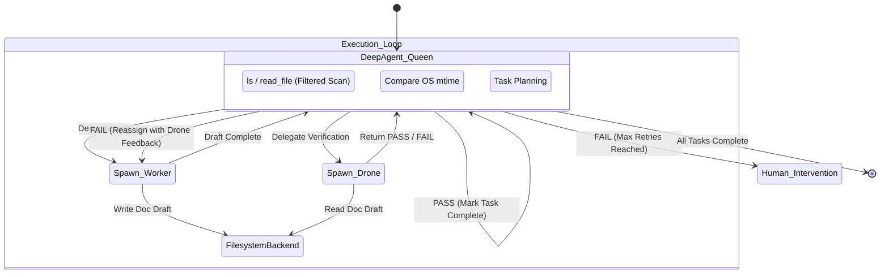

# AutoDoc Agent Swarm (DeepAgents Edition)

An advanced, hierarchical multi-agent system designed to autonomously analyze, template, generate, and verify documentation for any given code repository using [LangChain](https://github.com/langchain-ai/langchain) and [DeepAgents](https://github.com/deepagents/deepagents).

## Overview

The AutoDoc Agent Swarm minimizes boilerplate orchestration by leveraging the power of deepagents native toolset. It consists of three distinct agent roles that collaborate to ensure exceptionally high-quality technical documentation:

1. **Swarm Queen (Orchestrator)**: Uses native `deepagents` tools to deeply scan the codebase, evaluate documentation freshness, and delegate tasks. It strictly enforces retry loops and maintains a master "Todo" plan.
2. **Swarm Worker (Creator)**: A specialized technical writer subagent that parses source code and generates modular Markdown documentation, enriched with PlantUML diagrams and strict audit trails.
3. **Swarm Drone (Evaluator)**: A "devil's advocate" QA subagent. It critiques the Worker's output to ensure schema compliance, valid PlantUML syntax, and complete code coverage, returning structured feedback to the Queen.

## Features

- **Hierarchical Swarm Architecture**: Clear separation of concerns (Planning, Writing, Reviewing).
- **Multi-Provider LLM Support**: Configure the swarm to use OpenRouter, Anthropic, Google, or OpenAI out-of-the-box.
- **Per-Agent Model Configuration**: Assign distinct, optimized models for each agent (e.g. use a high-intelligence model for the Queen, and faster/cheaper models for the Worker and Drone).
- **Secure Filesystem Backend**: Implements a strict `SecureFilesystemBackend` preventing the LLM from inadvertently accessing or leaking sensitive data (`.env`, `.pem`, secrets, `.git`, `node_modules`).
- **Smart Incremental Updates**: Built-in freshness checks so the Swarm only documents files that have changed since the last run.
- **Mirrored Output Directory**: Output documentation elegantly mirrors the exact directory structure of the source code.

## Architecture Diagram



## Installation

This project uses `uv` for lightning-fast dependency management.

1. **Install `uv`** (if not already installed):
   Follow instructions at https://github.com/astral-sh/uv to install uv.

2. **Clone and Initialize**:
   ```bash
   git clone <your-repo-url>
   cd autodoc-swarm
   uv sync
   ```

3. **Configure Environment Variables**:
   Copy the example environment file and add your preferred API keys:
   ```bash
   cp .env.example .env
   ```
   *Edit `.env` to include your `OPENROUTER_API_KEY`, `ANTHROPIC_API_KEY`, etc. Optional LangSmith tracing configurations are also included.*

## Usage as a GitHub Action

AutoDoc Swarm is published as a GitHub Action. Add it to any workflow to automatically generate and commit documentation whenever code changes.

### Prerequisites

1. **API key secret** — Add your LLM provider API key to your repository secrets:
   `Settings → Secrets and variables → Actions → New repository secret`

2. **Token with write access** — The action commits generated docs back to the branch. You can use either:
   - A **Personal Access Token (PAT)** stored as a secret (e.g. `PAT_TOKEN`) — recommended so the commit triggers downstream workflows
   - The built-in `secrets.GITHUB_TOKEN` — simpler, but commits made with it will not trigger further workflow runs

3. **Workflow permissions** — The job must have `contents: write` permission.

### Minimal Setup

Create `.github/workflows/autodoc.yml` in your repository:

```yaml
name: AutoDoc

on:
  push:
    branches:
      - main

jobs:
  autodoc:
    runs-on: ubuntu-latest
    permissions:
      contents: write
    steps:
      - uses: actions/checkout@v4
        with:
          fetch-depth: 0  # required for smart diffing

      - uses: ROHITHGMURALI/AutoDoc@main
        with:
          github_token: ${{ secrets.PAT_TOKEN }}
          api_key: ${{ secrets.OPENROUTER_API_KEY }}
          provider: openrouter
          queen_model: anthropic/claude-3.5-sonnet
          worker_model: anthropic/claude-3.5-sonnet
          drone_model: anthropic/claude-3.5-sonnet
          target_dir: ./
```

### All Inputs

| Input | Required | Default | Description |
|---|---|---|---|
| `github_token` | Yes | — | Token used to commit and push generated docs back to the branch |
| `api_key` | Yes | — | API key for the chosen LLM provider |
| `provider` | Yes | `openrouter` | LLM provider: `openrouter`, `anthropic`, `openai`, or `google` |
| `queen_model` | Yes | `anthropic/claude-3.5-sonnet` | Model for the Swarm Queen (orchestrator) |
| `worker_model` | Yes | `anthropic/claude-3.5-sonnet` | Model for the Swarm Worker (writer) |
| `drone_model` | Yes | `anthropic/claude-3.5-sonnet` | Model for the Swarm Drone (QA reviewer) |
| `target_dir` | Yes | `.` | Directory within the repo to scan and document |

### Provider & Model Examples

**OpenRouter (cheapest for testing):**
```yaml
provider: openrouter
queen_model: anthropic/claude-3.5-sonnet
worker_model: qwen/qwen3.6-plus:free
drone_model: qwen/qwen3.6-plus:free
api_key: ${{ secrets.OPENROUTER_API_KEY }}
```

**Anthropic direct:**
```yaml
provider: anthropic
queen_model: claude-opus-4-6
worker_model: claude-sonnet-4-6
drone_model: claude-haiku-4-5-20251001
api_key: ${{ secrets.ANTHROPIC_API_KEY }}
```

**OpenAI:**
```yaml
provider: openai
queen_model: gpt-4o
worker_model: gpt-4o-mini
drone_model: gpt-4o-mini
api_key: ${{ secrets.OPENAI_API_KEY }}
```

**Google:**
```yaml
provider: google
queen_model: gemini-2.0-flash
worker_model: gemini-2.0-flash
drone_model: gemini-2.0-flash
api_key: ${{ secrets.GOOGLE_API_KEY }}
```

### How It Works

1. On every push the action checks which files changed (smart diffing via `git diff`).
2. The Swarm Queen scans the `target_dir`, evaluates documentation freshness, and builds a task list.
3. The Swarm Worker generates Markdown documentation with PlantUML diagrams for each file.
4. The Swarm Drone reviews each doc and returns `PASS` or `FAIL` with feedback. Failed docs are retried up to 3 times.
5. All generated docs are committed back to the same branch under `<target_dir>/documentation/`, mirroring the source tree structure.

### Output Structure

Given a `target_dir` of `./src`, generated docs appear at:
```
src/
├── api/
│   └── routes.py
documentation/
└── src/
    └── api/
        └── routes.md
```

---

## Local CLI Usage

A Typer CLI is also provided for running the swarm locally.

### Basic Execution

```bash
uv run python run_swarm.py --target ./src
```

### Advanced Execution

```bash
uv run python run_swarm.py \
    --target ./my_backend_service \
    --provider openai \
    --queen-model gpt-4o \
    --worker-model gpt-4o-mini \
    --drone-model gpt-4o-mini
```

## Development & Testing

To run the integration and unit test suite:

```bash
uv run pytest
```

Tests include validations for:
- The `SecureFilesystemBackend` successfully blocking access to `.env` files.
- The `check_file_freshness` logic accurately assessing modification timestamps.
- Successful initializations and distinct LLM assignments for the Queen and subagents.
- Documentation filesystem mirroring behavior.
